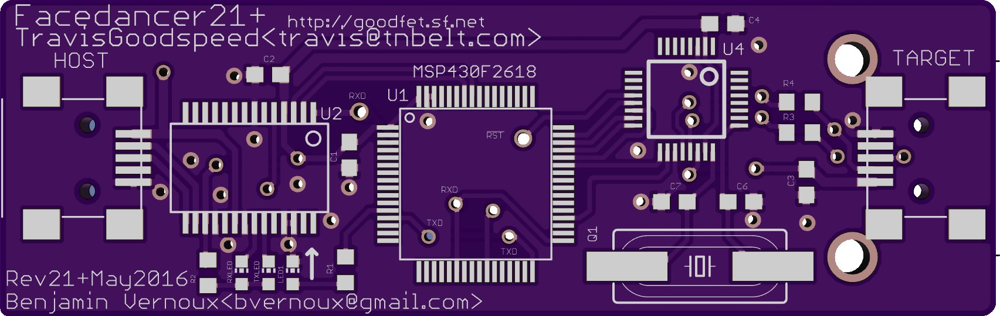
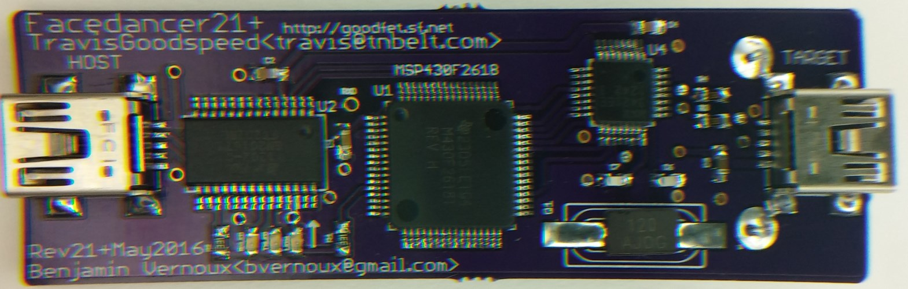

FaceDancer21+

Based on Facedancer21 (By Travis Goodspeed) but smaller (65.9mm x21 mm) with improved routing, decoupling capacitor/USB traces.

For more details see original (Travis Goodspeed) FaceDancer21 website:
http://goodfet.sourceforge.net/hardware/facedancer21

See also PCB on OSH Park
https://oshpark.com/shared_projects/DaynyAWY
